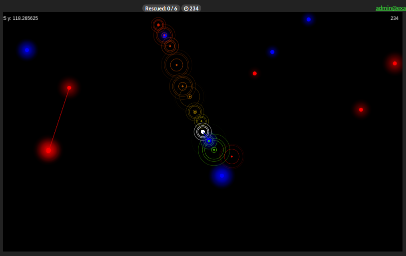

# Rescue Me Qietly - Global Game Jam 2018

Rescue the victims by sending transmission signals in the near environment. Beware that there are enemies, that have better receivers than your victims to be rescued! Yourself is also emitting a signal. If an enemy reaches (kills) a victim or you, you lost. If all victims are rescued you have won! Each level improvement raises the number of victims and enemies and lowers the time left.

